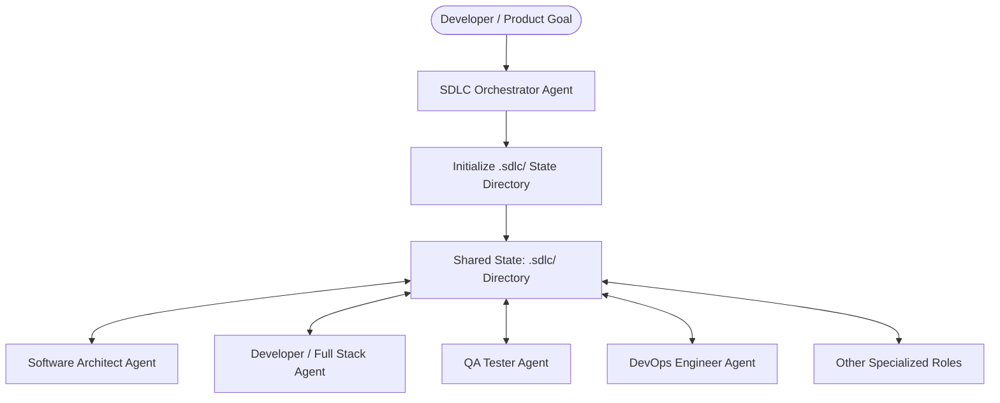

# 🚀 Awesome-VibeCoder

> A production-grade, highly customizable toolbox of custom AI agent definitions, modular system instructions, reusable skills, and multi-agent SDLC workflows. Designed to turn simple LLM coding assistants into fully orchestrated, state-aware engineering teams.

[](LICENSE)
[](CONTRIBUTING.md)
[](https://github.com/crowne/Awesome-VibeCoder)
[](https://awesome.re)

---

## 📖 Table of Contents

- [Introduction](#-introduction)
- [Repository Layout](#-repository-layout)
- [The Always-On SDLC Multi-Agent System](#-the-always-on-sdlc-multi-agent-system)
- [How to Use This Repository](#-how-to-use-this-repository)
  - [1. Single-Agent Mode (Standalone)](#1-single-agent-mode-standalone)
  - [2. Multi-Agent Team Mode (Orchestrated)](#2-multi-agent-team-mode-orchestrated)
  - [3. Customizing Your IDE (Copilot / Cursor)](#3-customizing-your-ide-copilot--cursor)
- [Documentation Index](#-documentation-index)
- [Contributing](#-contributing)
- [License](#-license)

---

## ✨ Introduction

**Awesome-VibeCoder** is a curated, open-source directory of customization assets for AI coding tools (such as GitHub Copilot and Cursor). It enables developers to implement structured, role-based workflows for software engineering. Rather than relying on simple, single-prompt instructions, Awesome-VibeCoder provides:

*   **35+ Specialized Agents** (`.agent.md`): Structured personas for roles ranging from Database Architects to DevOps Engineers, plus dedicated web design-system and performance engineers.
*   **87+ Modular System Instructions** (`.instructions.md`): Deep domain-specific rules (languages, frameworks, secure coding patterns).
*   **42+ Task-Focused Skills** (`SKILL.md`): Reusable execution guides for planning, refactoring, context-mapping, interface evaluation, design systems, accessibility audits, and performance budgets.
*   **Structured Workflows** (`.workflow.md`): Execution blueprints to orchestrate parallel or sequential multi-agent activities.

---

## 📂 Repository Layout

Below is a breakdown of the repository's core directories and their corresponding entry points:

| Directory | Description | Documentation |
| :--- | :--- | :--- |
| [`/agents`](agents/) | 35+ custom agent profiles defining role identities, system instructions, and task domains. | [Agents Catalog](docs/README.agents.md) |
| [`/instructions`](instructions/) | 87+ markdown guides detailing styling, language features, security (OWASP), and CI/CD. | [Instructions Library](docs/README.instructions.md) |
| [`/skills`](skills/) | 42+ self-contained skill packages containing runbooks and markdown templates. | [Skills Catalog](docs/README.skills.md) |
| [`/workflows`](workflows/) | Sequence maps and concurrency stages to run agent chains in parallel or series. | [Workflows Catalog](docs/README.workflows.md) |
| [`/docs`](docs/) | Complete documentation, guides, and integration materials (e.g. MCP guidelines). | [Documentation Portal](docs/README.sdlc-system.md) |
| [`/cookbook`](cookbook/) | Runnable recipes for the Copilot SDK and the modern web stack (Node.js, React, Next.js, Astro, Svelte, Vue). | [Cookbook Index](cookbook/README.md) |
| [`/.github`](.github/) | Mirrors of active assets, prompt layouts, and customization configurations. | - |

---

## 🤖 The Always-On SDLC Multi-Agent System

The centerpiece of this repository is the **Modular SDLC System**, which defines a set of **16 specialized roles** that cooperate using an **Always-On Centralized State Architecture**. 

Instead of agents operating in isolation, they read and write to a centralized `.sdlc/` directory at the project root. This file-based state plane holds project requirements, architecture specifications, API contracts, active context, and progress logs.

### Collaboration & State Architecture



### The Shared Knowledge Layer (`.sdlc/`)
When executing, team agents interact through structured markdown documents:
```text
.sdlc/
├── projectbrief.md              # Goals, scope, and constraints
├── architecture.md              # System design, models, and boundaries
├── techContext.md               # Technology stack and dependencies
├── activeContext.md             # Active developer focus
├── progress.md                  # Task and lifecycle tracking
├── systemPatterns.md           # Conventions and coding standards
├── tasks/                       # Task files with lifecycle tracking
├── decisions/                   # Architecture Decision Records (ADRs)
├── contracts/                   # Cross-role agreements (API, DB schemas, security)
├── handoffs/                    # Agent-to-agent task transfer handoffs
└── memory.md                    # Cross-session memory and lessons learned
```

---

## 🚀 How to Use This Repository

### 1. Single-Agent Mode (Standalone)
You do not need to adopt the entire SDLC pipeline to benefit from this repo. You can run any agent file (such as `planning-agent.agent.md` or `sdlc-developer.agent.md`) individually:
*   On startup, the agent checks for a `.sdlc/` directory at the project root.
*   If missing, it initializes it with basic templates.
*   If present, it loads the baseline context, performs its tasks, and appends logs to `.sdlc/memory.md` and `.sdlc/progress.md`.

### 2. Multi-Agent Team Mode (Orchestrated)
For large-scale, automated engineering tasks:
1.  Initialize your workspace using the [SDLC Orchestrator Agent](agents/sdlc-orchestrator.agent.md).
2.  Decompose your project goals into modular task lists using the [Product Manager](agents/sdlc-product-manager.agent.md) or [Software Architect](agents/sdlc-software-architect.agent.md) agents.
3.  Coordinate execution using one of the pre-built blueprints:
    *   **[Sequential Workflow](workflows/sdlc-sequential.workflow.md)**: Standard step-by-step role execution (Architect ➔ Designer ➔ Developer ➔ Tester).
    *   **[Parallel Workflow](workflows/sdlc-parallel.workflow.md)**: Concurrency-optimized phases with strict quality/dependency gates.

### 3. Customizing Your IDE (Copilot / Cursor)
*   **GitHub Copilot**: Copy selected `.instructions.md` and `.agent.md` files into `.github/prompts/` to customize chat participants and inline suggestion parameters.
*   **Cursor**: Reference these files in your `.cursorrules` or copy active instructions to tailor the LLM's workspace understanding.
*   **MCP Servers**: Integrate with Model Context Protocol (MCP) servers using our [MCP Integration Guide](docs/mcp-integration-guide.md).

---

## 📚 Documentation Index

To explore the deeper technical details of the ecosystem, refer to the guides below:

*   **[SDLC System Architecture](docs/README.sdlc-system.md)**: Core design patterns, the shared memory specification, and handoff protocols.
*   **[Agents Guide](docs/README.agents.md)**: Deep-dive on modular vs standalone agents, active roles, and retired profiles.
*   **[System Instructions](docs/README.instructions.md)**: Guide to language conventions, framework configurations, and security guardrails.
*   **[Skills & Runbooks](docs/README.skills.md)**: Overview of foldered skills, trigger conditions, and implementation templates.
*   **[Multi-Agent Workflows](docs/README.workflows.md)**: Sequential vs parallel configurations and orchestration rules.
*   **[MCP Integration Guide](docs/mcp-integration-guide.md)**: Configuring Model Context Protocol tools for backend and frontend agent workflows.

---

## 🤝 Contributing

Awesome-VibeCoder is open source and community-driven! We welcome contributions to make the agents, instructions, skills, and workflows more robust.

Please read our **[Contributing Guidelines](CONTRIBUTING.md)** to learn about:
1.  How to submit new agents or instructions.
2.  Ensuring backward compatibility with the `.sdlc/` state model.
3.  Writing clean, modular `.instructions.md` files.

---

## 📄 License

This repository is distributed under the **MIT License**. See [LICENSE](LICENSE) for details.
